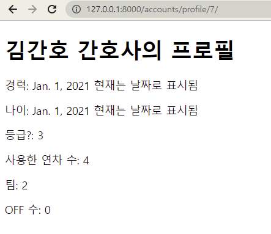

# DFN 진행 상황 (21.10.23)

<br>

## model 객체 생성

.assets/ERD_00.drawio.png)

`User`와 `Profile`은 1:1의 관계를, `User`와 `Event`는 1:N의 관계를 맺는다.

```python
# accounts/models.py

from django.db import models
from django.contrib.auth.models import AbstractUser
from django.conf import settings


class User(AbstractUser):
    pass


class Profile(models.Model):
    user = models.OneToOneField(settings.AUTH_USER_MODEL, on_delete=models.CASCADE)
    name = models.CharField(max_length=10)
    WEX = models.DateField()
    DOB = models.DateField()
    level = models.IntegerField(default=3)
    PTO = models.IntegerField(default=0)
    team = models.IntegerField()
    OFF = models.IntegerField(default=0)

    def __str__(self):
        return  self.name
```

```python
# duty_creater/models.py

from django.db import models
from django.conf import settings


class Event(models.Model):
    # on_delete=DO_NOTHING: nurse user가 삭제되어도 db를 수정하거나 삭제하지 않는 것으로 추정
    nurse = models.ForeignKey(settings.AUTH_USER_MODEL, on_delete=models.DO_NOTHING)
    date = models.DateField()
    duty = models.IntegerField()

    def __str__(self):
        return f'{self.date}N{self.nurse.pk}D{self.duty}'
```

<br>

## 사용자 관리 시스템 생성

`accounts` 앱에 다음과 같은 기능을 추가하였다. 필요한 수정사항은 함께 기록하였다.

1. profile: 간호사의 프로필 보기
   1. 경력과 나이는 입력한 날짜를 기준으로 계산하여 정수로 반환하도록 변경
2. create profile: 간호사의 프로필 생성
   1. 로그인한 사용자만 프로필을 생성할 수 있고 이미 프로필이 있는 사용자는 프로필을 생성할 수 없도록 변경
   2. 작성해야 하는 form 항목의 이름 변경
   3. form의 날짜 항목의 선택 순서를 한국 기준으로, 올해 이전을 선택할 수 있도록 변경
   4. form에서 최댓값이 존재하는 항목은 이를 반영해 선택할 수 있도록 변경
3. login: 로그인
4. logout: 로그아웃

```python
# accounts/views.py
# profile 함수와 create_profile 함수

def profile(request, nurse_pk):
    nurse = get_object_or_404(get_user_model(), pk=nurse_pk)
    if Profile.objects.filter(user_id=nurse_pk).exists():
        profile = Profile.objects.get(user_id=nurse_pk)
        context = {
            'nurse': nurse,
            'profile': profile,
        }
        return render(request, 'accounts/profile.html', context)
    else:
        return redirect('accounts:create_profile')


def create_profile(request):
    if request.method == 'POST':
        form = ProfileForm(request.POST)
        if form.is_valid:
            profile = form.save(commit=False)
            profile.user = request.user
            profile.save()
            return redirect('accounts:profile', request.user.pk)
    else:
        form = ProfileForm()
    context = {
        'form': form,
    }
    return render(request, 'accounts/create.html', context)
```



.assets/create_profile.png)

<br>

## 듀티 저장 시스템 생성

`duty_creater` 앱에 생성된 듀티 정보를 받아와 이를 DB에 저장하는 기능을 추가하였다.

```python
# duty_creater/views.py

def new(request):
    duties = [
        [1, 0, 0, 0, 0, 0, 3, 0, 0, 0, 0, 0, 0, 2, 0, 
         0, 0, 2, 3, 0, 0, 0, 3, 0, 0, 0, 3, 0, 0, 0, 3], 
        [2, 3, 0, 1, 2, 3, 0, 1, 2, 3, 0, 1, 2, 3, 0, 
         1, 2, 3, 0, 1, 2, 3, 0, 1, 2, 3, 0, 1, 2, 3, 0], 
        [0, 2, 0, 0, 0, 2, 0, 0, 0, 2, 0, 0, 1, 0, 0, 
         0, 1, 0, 0, 0, 0, 2, 0, 0, 0, 2, 0, 0, 0, 2, 0], 
        [0, 1, 2, 3, 0, 1, 2, 3, 0, 1, 2, 3, 0, 1, 2, 
         3, 0, 1, 2, 3, 0, 1, 2, 3, 0, 1, 2, 3, 0, 1, 2], 
        [3, 0, 1, 2, 3, 0, 1, 2, 3, 0, 1, 2, 3, 0, 1, 
         2, 3, 0, 1, 2, 3, 0, 1, 2, 3, 0, 1, 2, 3, 0, 1], 
        [0, 0, 3, 0, 1, 0, 0, 0, 1, 0, 3, 0, 0, 0, 3, 
         0, 0, 0, 0, 0, 1, 0, 0, 0, 1, 0, 0, 0, 1, 0, 0]
    ]
    
    # 새로운 듀티의 시작 날, 이후 사용자에게 XX달을 입력받는 것으로 수정 필요
    start_date = '20-01-01'  
	
    # 함수가 완성되지 않은 상태에서 실행할 때마다 DB가 늘어나 이를 모두 제거한다.
    Event.objects.all().delete()  
	
    # 간호사의 한 달 듀티 추가 과정
    for nurse_id in range(2, 8):  # range()는 이후 간호사 id를 담은 리스트로 변경 필요
        # datetime 객체로 변환
        date = datetime.datetime.strptime(start_date, '%y-%m-%d')  
        
        # 2차원 리스트로는 현재 리스트가 어떤 간호사에 해당하는지 구분되지 않아
        # 임시로 현재 간호사의 id와 일치하는 인덱스의 duties 리스트를 통해 
        # 간호사의 한 달 듀티를 추가한다.
        for duty in duties[nurse_id - 2]:  
            # Event 생성
            Event.objects.create(date=date, duty=duty, nurse_id=nurse_id)  
            date = date + datetime.timedelta(days=1)  # 하루 추가
	# datetime 객체로 변환
    date = datetime.datetime.strptime(start_date, '%y-%m-%d')  
    
    # 하루를 기준으로 해당 날의 듀티를 따로 기록하는 과정
    duties_of_day = [[0] * 3 for _ in range(31)]
    for day in range(31):
        # 원하는 날을 변수에 저장한 후 이를 이용해 해당 날짜와 해당하는 queryset을 가져옴
        wanted_date = str(date + datetime.timedelta(days=day))[:10]
        duties_of_wanted_date = Event.objects.filter(date=wanted_date).all()
        
        # 리스트의 인덱스를 듀티와 연결지어 각 듀티를 담당하는 간호사 id를 저장
        for duty in [1, 2, 3]:
            duties_of_day[day][duty - 1] = duties_of_wanted_date.filter(duty=duty).values('nurse_id')
        
    # 원하는 달의 모든 queryset을 가져옴
    duties_of_month = Event.objects.filter(date__startswith='2020-01').all()
    
    context = {
        'duties_of_month': duties_of_month,
        'duties_of_day': duties_of_day,
    }
    return render(request, 'duty_creater/new.html', context)
```

```django
<!-- duty_creater/new.html -->

<!DOCTYPE html>
<html lang="en">
<head>
  <meta charset="UTF-8">
  <meta http-equiv="X-UA-Compatible" content="IE=edge">
  <meta name="viewport" content="width=device-width, initial-scale=1.0">
  <style>
    table,
    td {
        border: 1px solid #333;
        padding: 10px
    }

    thead,
    tfoot {
        background-color: #333;
        color: #fff;
    }

    duty1 {
      background-color: black;
    }
  </style>
  <title>Document</title>
</head>
<body>
  <h1>이달의 듀티를 생성하세요</h1>
  
  <table>
    <thead>
      <tr>
          <th colspan="4">한달 스케쥴</th>
      </tr>
      <tr>
          <td></td>
          <td>DAY</td>
          <td>NIGHT</td>
          <td>EVENING</td>
      </tr>
    </thead>
    <tbody>
      
      <tr>
        <td>날짜</td>
        
          <td>{{ nurse }}</td>
        
      </tr>
      
    </tbody>
  </table>
</body>
</html>
```

.assets/db.png)

.assets/new.png)

### 개선해야 할 사항

1. 듀티 작성 알고리즘을 통해 반환받은 리스트에서 어느 리스트가 어느 간호사에 해당하는 항목인지 구분할 수 있도록 간호사의 id와 생성된 듀티간의 연결 관계를 생성한다.
2. 사용자가 직접 원하는 달을 선택하면 이를 기준으로 `Event` 객체를 생성한다.
3. `date`, `duty`, 간호사의 정보를 어떻게 조합하여 `context`로 보낼지는 출력 형태가 정해진 이후 정하도록 한다.
4. `Event` 객체에서 `User` 객체를 참조한 후 `User` 객체에서 `Profile` 객체를 참조하여 queryset이 아닌 간호사의 정보를 출력 또한 가능하도록 한다.
5. DB 생성에 시간이 꽤 소요되는데 이후 문제가 될 수도 있을 것 같다.