# DutyForNurses

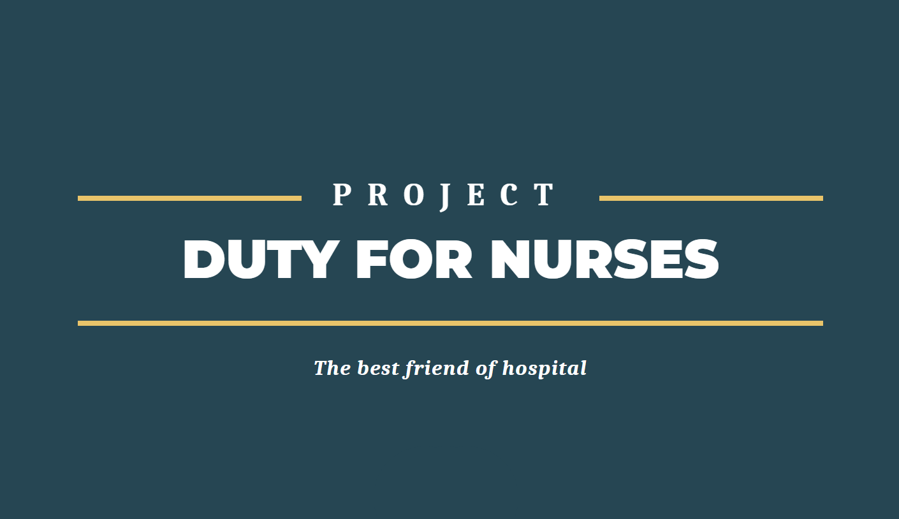

**`Duty For Nurses`**는 강력하고 빠른 듀티표 생성, 직관적인 개인별 및 팀별 듀티표를 제공하는 생산성 툴입니다. 어렵고 힘든 듀티표 생성 업무는 DFN에 맡겨주세요!

<br>

# 기획

## 1. **어떤 문제를 해결하는가?**

종합병원에 근무하는 간호사들에게 '듀티표 제작'은 엄청난 스트레스입니다. 고려해야 할 변수들이 너무나 많기 때문입니다. 우선 매일매일 일정한 수의 간호사들이 모든 근무 시간대별로(주간, 저녁, 야간) 근무해야 합니다. 주말에 야근을 하고 싶어하는 사람들은 아무도 없으니 특정 간호사에게 주말 야간 근무가 몰리는 일도 없어야 합니다. 야간 근무 다음 날 하루 쉬고, 바로 주간 근무를 시작하는 불합리한 근무도 피해야 합니다. 거기다가 경조사 등의 일정이 생기면 휴가를 쓰기도 해야 합니다. 

실제로 이러한 점들을 다 고려하며 듀티표를 짤 경우, **18인 규모의 듀티표 제작에만 이틀정도가 소모**된다고 합니다.  간호사별 스케쥴 수정 요청을 받는 시간까지 고려하면 듀티표 제작은 훨씬 더 오래 걸리게 됩니다. 간호사들은 **보통 휴무일에 시간표를 제작**하기 때문에  **듀티표 생성**은 그 자체로 **간호사들에게 엄청난 스트레스**입니다**.** 이런 문제를 해결하기 위해 **'Duty For Nurse'**를 제작했습니다. 

- [**의뢰받은 병원의 근무 조건**](https://bustling-carver-c58.notion.site/427c427689824d219e56a39b1c5d30ac)

참고할 만 한 신문 기사 - 잘못된 간호사 듀티표가 간호사들의 삶의 질에 미치는 영향

[나오데, 더블듀티···간호사의 잠 못 이루는 밤](https://m.khan.co.kr/view.html?art_id=202105220907011)

<br>

## 2. **기존 문제 해결법의 한계 - 엑셀 시간표들**

구글링을 해보시면 **'엑셀'** 기반으로 제작된 스케쥴 제작 프로그램이 많습니다. 하지만 이 프로그램들을 직접 다운받아 사용해 본 결과 아래의 단점들이 있었습니다.

- **직관적이지 않고:**  엑셀의 특성상 실제 사용을 위해 매뉴얼을 외워야 하는 부분이 많습니다.
- **불안정하며:** 대부분의 기능을 사용하려면 '원본 시트를 복사/붙여넣기' 해야 합니다. 이 과정에서 실수가 일어난다 하더라도 프로그램은 어떠한 경고도 제공하지 않습니다. 실수로 고장내기가 굉장히 쉽습니다.
- **사용자** **친화적이지 않고**: 브루트포스식으로 듀티표를 생성해서 '6연속 야간 근무' 같은 불합리한 근무를 하게 됩니다.
- **파편화되어**: 결국 간호사들은 간호사별 연차, 휴무 등 정보를 관리하는 새로운 엑셀 파일을 생성해야 합니다.
- **일을 줄여주지 못하는**: 일을 줄이고자 도입했던 프로그램이 1) 프로그램을 관리하는 일 2) DB를 관리하는 새로운 일을 만듭니다. 개별 간호사들 또한 만들어진 듀티표를 자신의 휴대폰 앱에 수기로 옮기는 등 귀찮은 일을 하게 됩니다.

<br>

## 3. **어떻게 문제를 해결하는가?**

- **직관적이고:**  클릭 1~2회 내로 시간표 생성, 수정, 휴가 신청 등이 가능합니다.
- **안정적으로:**  사용자의 실수나 부주의한 클릭으로도 고장나지 않습니다. 자동으로 DB에 연동되어 연차 정보 등을 편하게 관리할 수 있습니다.
- **사용자 친화적으로**: 일반적으로 가장 많이 사용하는 '엑셀' 시간표의 UI를 옮겨왔습니다.
- **삶의 질을 개선하며**:
- 클릭 1~ 2회 내에 시간표 생성, 수정,  휴가 신청 등이 가능.
- 휴일, 이전 달 근무, 나이 및 연차 등을 고려한  **인간적이며 상식적인** 스케쥴 제작 알고리즘.
- 빠른 스케쥴 제작 속도(평균 7ms)
- 개인별 시간표를 달력 형태를 제공.

<br>

# 설치 및 사용

## **Project setup**

You need `python 3.8 +`  to run this project.

## **Instruction**

1️⃣ **make Python virtual environment.**

```bash
python -m venv venv
```

2️⃣ **activate virtual environment.**

WINDOWS

```bash
source venv/Scripts/activate
```

MAC

```bash
source venv/bin/activate
```

3️⃣ **install requirements**

```bash
pip install -r requirements.txt
```

4️⃣ **make `secrets.json` to your root directory. Your `secrets.json` needs to be like**

```json
{
  "SECRET_KEY": "django-insecure-{{YOUR_SECRET_KEY_HERE}}"
}
```

🤔**This little trick might help you.**

[https://github.com/openwisp/ansible-openwisp2/blob/master/files/generate_django_secret_key.py](https://github.com/openwisp/ansible-openwisp2/blob/master/files/generate_django_secret_key.py)

5️⃣ **make migrations and migrate.**

```bash
**python manage.py makemigrations
python manage.py migrate
python manage.py runserver**
```

6️⃣ **make account for head nurse.**

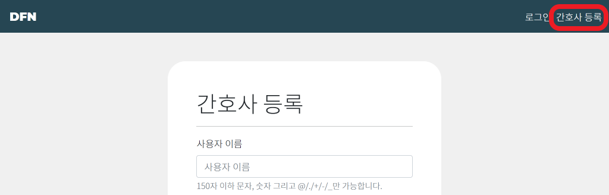

7️⃣ **create superuser**

```bash
python manage.py createsuperuser
```

 Go to `{{server_url}}/admin`  and log in with your superuser account.

8️⃣ find head nurse's account and make it a staff account. 

and check `is_staff(스태프 권한)`  to `True` 

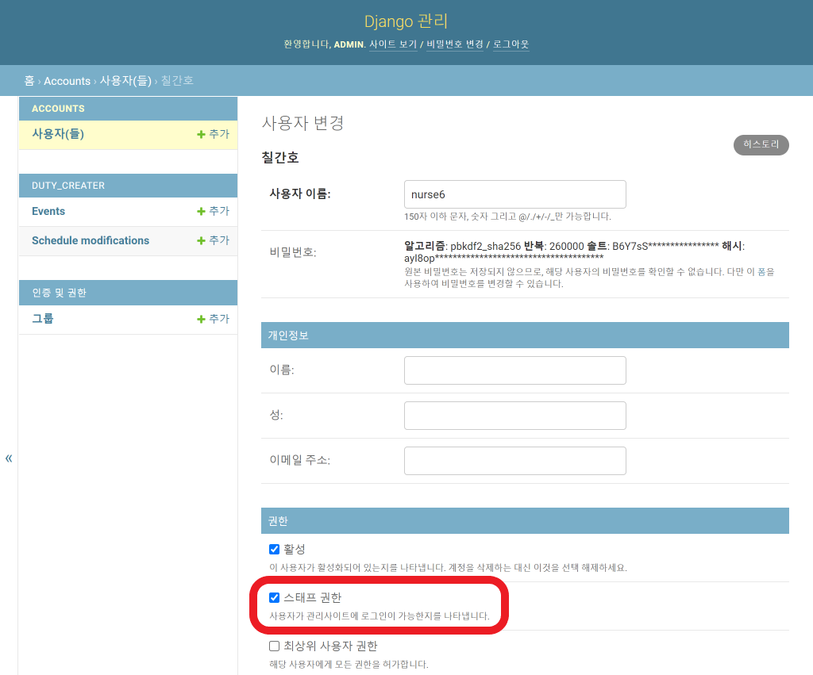

9️⃣ now you can start making schedules in no time!

※ Start virtual environment before you use the service.

<br>

# 제작 정보

## 1. 만든 사람들

프로젝트 기획 업무를 함께 진행하였습니다. 이후 전담한 업무는 아래와 같습니다. 

1. **Alexuhn** [alexuhyun@gmail.com](mailto:alexuhyun@gmail.com)
    1. 백 - Django를 이용한 웹사이트 기능 구현.
    2. 프론트 - Bootstrap5를 활용한 디자인. JS를 활용한 비동기 처리 구현. 
2. **Magpie1000** [web.1000c@gmail.com](mailto:web.1000c@gmail.com)
    1. 알고리즘 모듈 제작

## 2. 프로젝트 기간

2021.10.28 - 2021.11.08

## 3. 개발 도구

- Python
    - Python 3
    - Django 3.2.9
- HTML, CSS
    - Bootstrap 5
- Javescript
    - ECMA6 +
- Database
    - sqlite3
    

<br>

# 주요 UI/UX 특징

### 듀티표

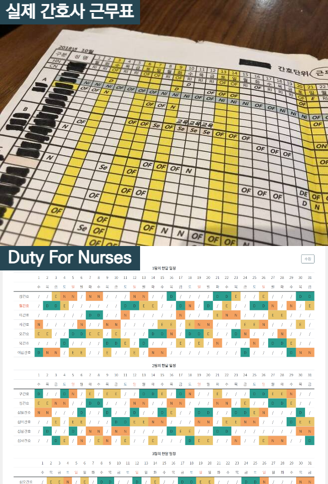

실제 간호사들이 사용하는 듀티표 샘플 사진입니다. 한 행에 개별 간호사의 근무 정보, 한 열에 하루 전체의 근무 정보를 엑셀 파일로 작성한 뒤, A4용지에 가로로 출력해 사용합니다. 주간 근무(Day), 저녁 근무(Evening), 야간근무(Night)를 약어로 표기합니다. 이러한 사용 경험을 연속적으로 유지해 사용자의 러닝커브를 최소화하고 편의성을 극대화하고자 했습니다. 

### 개인 듀티 조회

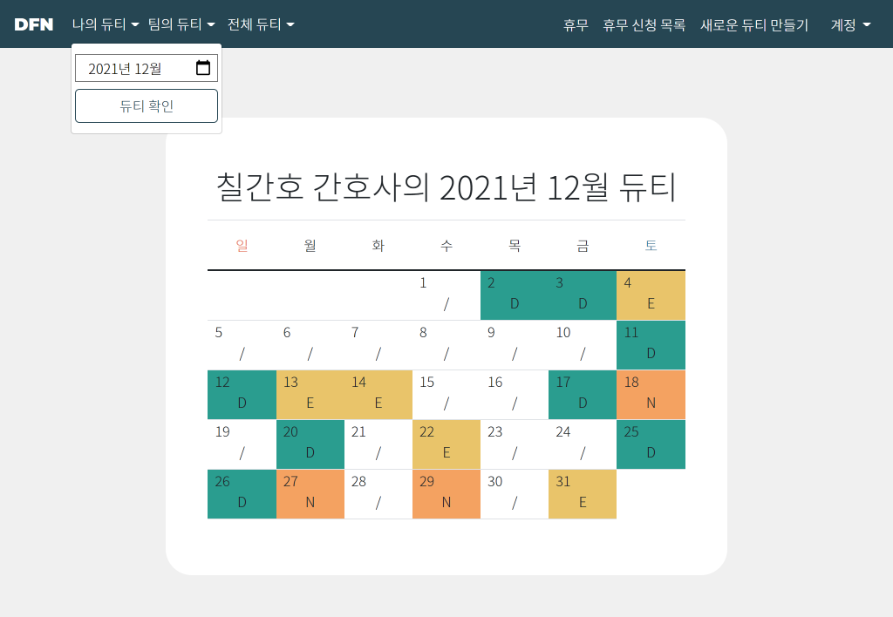

사용자는 개인의 한 달의 듀티표를 달력 형식으로 보기 쉽게 조회할 수 있습니다. `팀의 듀티`와 전체 팀의 듀티를 `전체 듀티`에서 조회할 수 있습니다. 또한 드랍다운 버튼을 선택하여 과거 날짜를 선택할 수 있습니다. 

### 듀티 생성

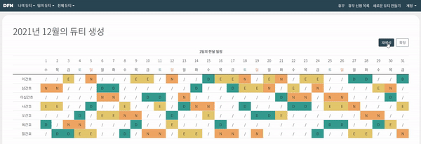

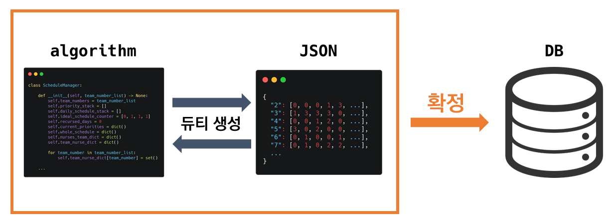

생성된 듀티표는 외부 JSON 파일에 우선 기록됩니다. 이는 사용자가 한 달의 듀티표를 확인 후 마음에 들지 않을때 변경을 용이하기 위함입니다. 듀티표는 `재생성` 버튼을 클릭해 만들 수 있으며 `확정`  버튼을 누르기 전까지 DB에 저장되지 않습니다. 이로써 DB부하를 줄일 수 있습니다. 또한 DB에는 확정된 근무표만 저장되므로 다른 간호사가 듀티를 조회할 때 '내 근무표가 지속적으로 변하는 것처럼 보이는' 현상을 미연에 방지할 수 있습니다.

### 개별 듀티 수정

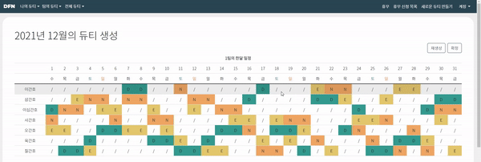

최적의 듀티표는 `사용자` 들이 만족하는 듀티표입니다. 저희 서비스는 사용자가 모두가 만족할 만 한 조건을 두루 갖춘 시간표를 눈 깜짝 할 사이보다 빠르게(생성 시간: 평균 7ms)에  제공합니다. 저희가 제공하는 시간표에 만족하시겠지만, 사소한 부분들을 수정해 듀티표를 더 개인화하고 싶으실 수 있습니다.  

모든 듀티는 생성된 즉시 수정이 가능합니다. 클릭 한 번에 간호사들의 개별 듀티를 원하는 대로 수정 가능합니다. 듀티표가 확정된 이후에도 `전체 듀티` 조회 페이지에서 같은 방법으로 쉽게 수정 가능합니다.

### 듀티 생성시 휴무 승인

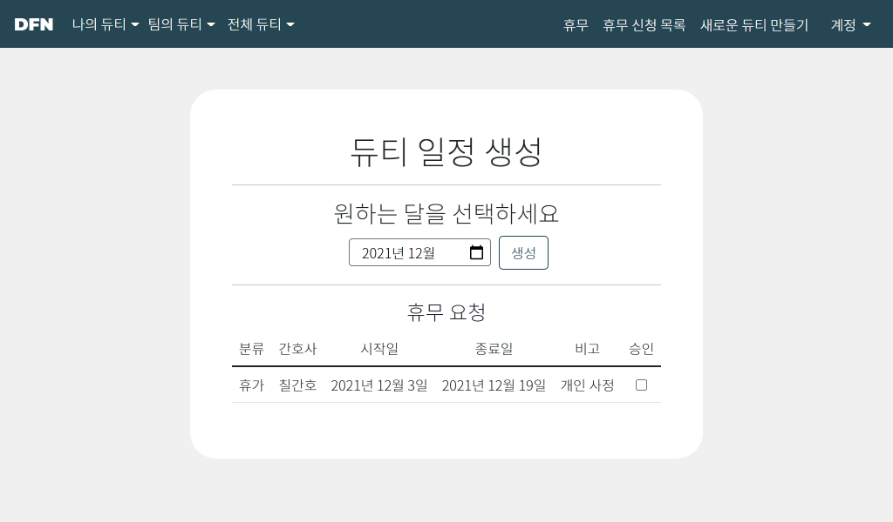

듀티표를 만드는 데에 가장 큰 걸림돌은 바로 '휴무' 입니다. 누군가 휴무를 신청하더라도 근무표 생성의 난해함 때문에 휴무가 반려당하는 일도 있습니다. DFN은 간호사들의 휴무도 고려해 시간표를 작성해드립니다. 

그리고 듀티 표 생성 전에 해당 월의 모든 휴무 요청들을 검토할 수 있어서 직관적입니다. 1) 승인 버튼을 누르고 2) 생성 버튼을 누르는 동작만으로 손쉽게 듀티표를 만들 수 있습니다. 

<br>

# 알고리즘 상세 소개

다익스트라 알고리즘을 기반으로 스택, 분할정복, 비트마스킹을 이용합니다. 

깔끔하게 모듈화되어 아래와 같이 자연스럽게 듀티표를 제작하 수 있습니다. 

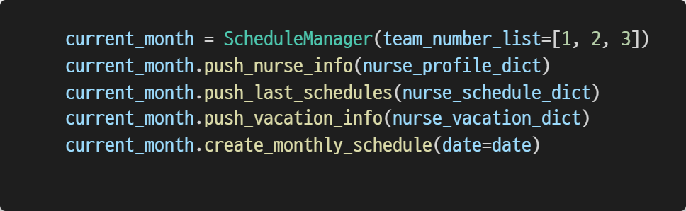

상세 코드는 아래 링크에서 확인하실 수 있습니다. 

[DutyForNurses/DutyForNurses/duty_creater/custom_classes at master · alexuhn/DutyForNurses](https://github.com/alexuhn/DutyForNurses/tree/master/DutyForNurses/duty_creater/custom_classes)

- **소개 슬라이드**
  
    
    
    
    
    
    
    
    
    
    
    
    
    
    
    
    
    
    
    
    
    
    
    
    
    
    
    
    
    
    
    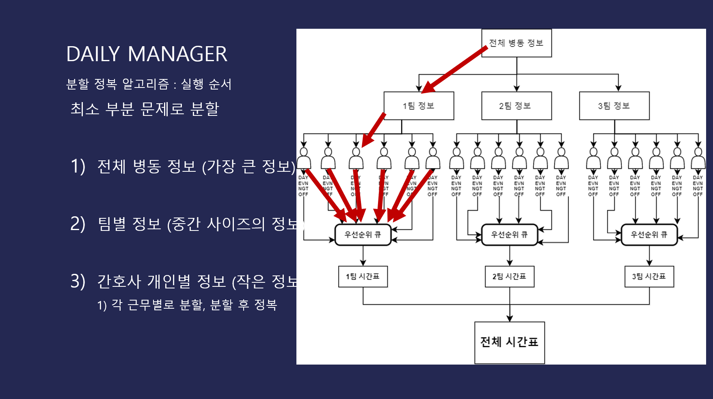
    
    
    
    
    
    
    
    
    
    
    
    
    
    
    
    
    
    
    
    
    
    
    
    
    
    
    
    

<br>

# 진행 기록

자세한 프로젝트 진행 기록은 [링크](https://github.com/alexuhn/DutyForNurses/tree/master/ProgressReport)에서 확인하실 수 있습니다.